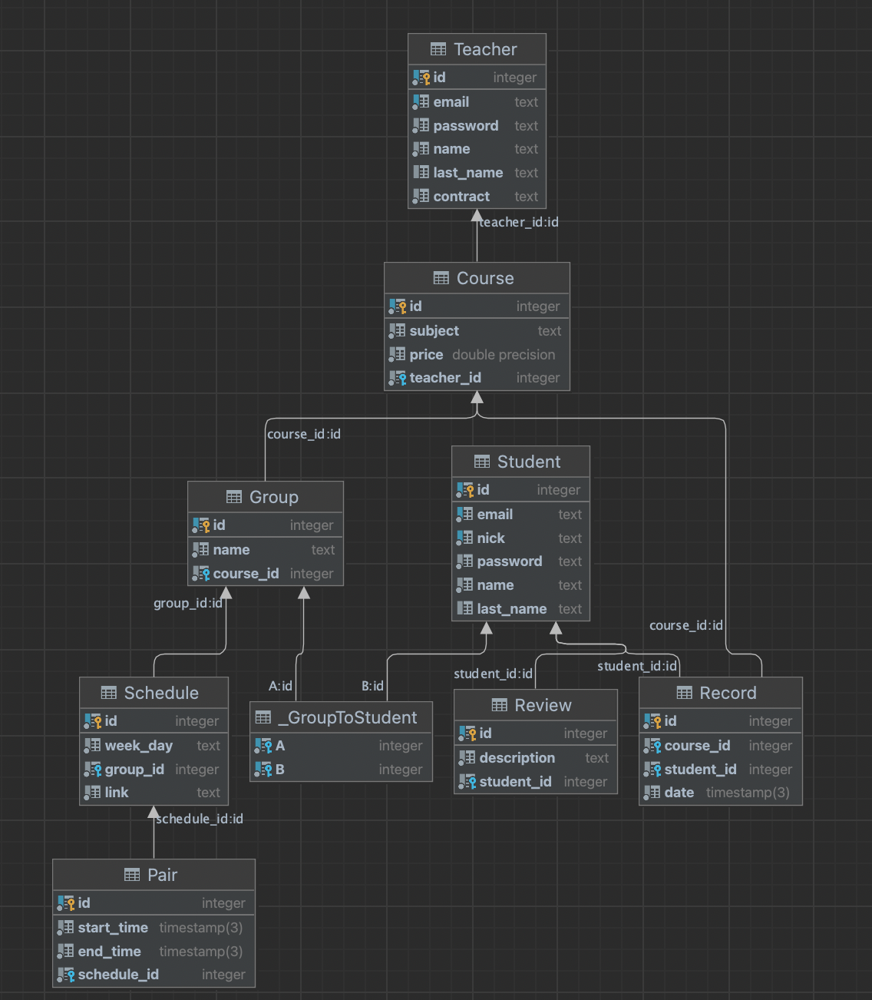

<h3>https://lospiesdescalzos-web.ru</h3>

## H&N school
6 semester web-project  
M33031 Жаркова Екатерина
  
ERD диаграмма

### Сущность Student(ученик)
* id - id ученика
* email - почта ученика, логин при регистрации/входе
* password - пароль ученика
* name - имя ученика
* nick - никнейм ученика
* last_name - фамилия ученика

### Сущносность Teacher(учитель)
* id - id учителя
* email - почта ученика, логин при регистрации/входе
* password - пароль учителя
* name - имя учителя
* last_name - фамилия учителя
* conrtact - номер трудового договора

### Сущность Course(курс)
* id - id урока
* subject - название дисциплины
* price - цена курса
* teacher_id - id - преподаватель дисциплины

### Сущность Group(группа)
* id - id урока
* name - название группы
* сourse_id - курс, к которому привязана группа

### Сущность Record(запись на урок)
* id - id записи
* course_id -  id курса, на которое происходит запись
* student_id - id ученика, который записывается на занятие

### Сущность Review (отзывы)
* id - id отзыва
* descrition - сам отзыв
* student_id - id ученика, который написал отзыв

### Сущность Schedule (рассписание)
* id - id 
* week_day - день недели
* group_id - id группы, у которой будет занятие
* link - ссылка на занятие

### Сущность Pair (пары)
* id - id пары
* start_time - время начала урока
* end_time - время окончания урока
* schedule_id - id расписания

